# CloudLens 架构可视化图

> 📅 更新时间: 2025-12-15  
> 🎯 目标: 用图形化方式展示系统架构

---

## 🏗️ 整体架构图

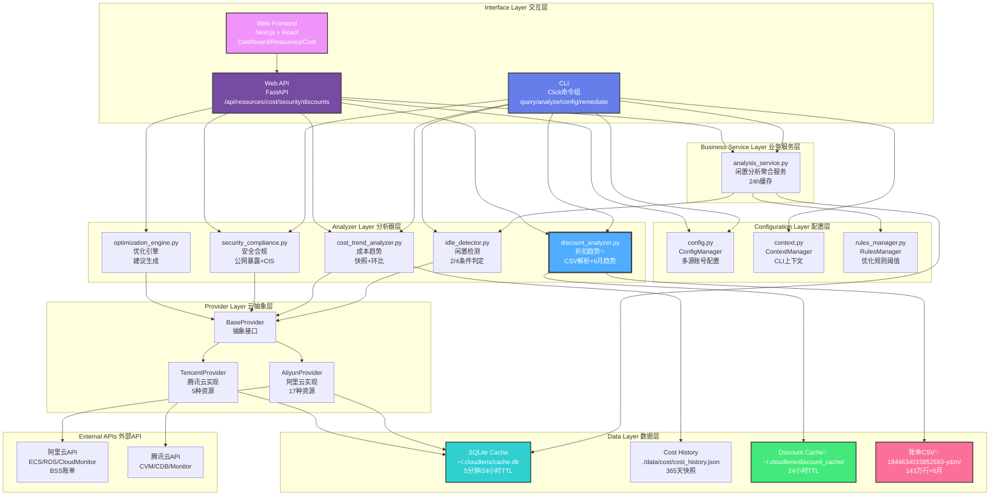

---

## 🔄 关键数据流图

### 数据流1: CLI资源查询

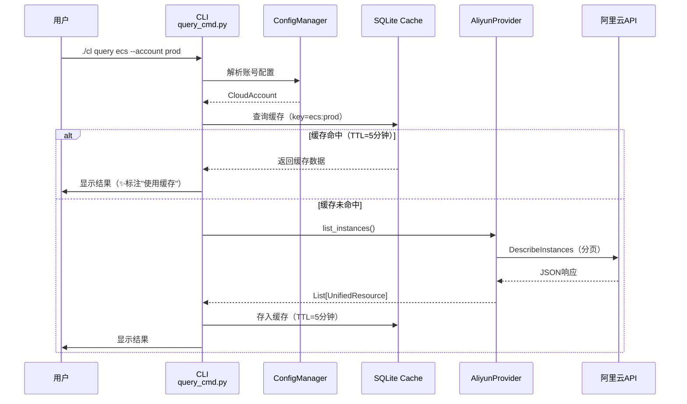

---

### 数据流2: CLI闲置分析

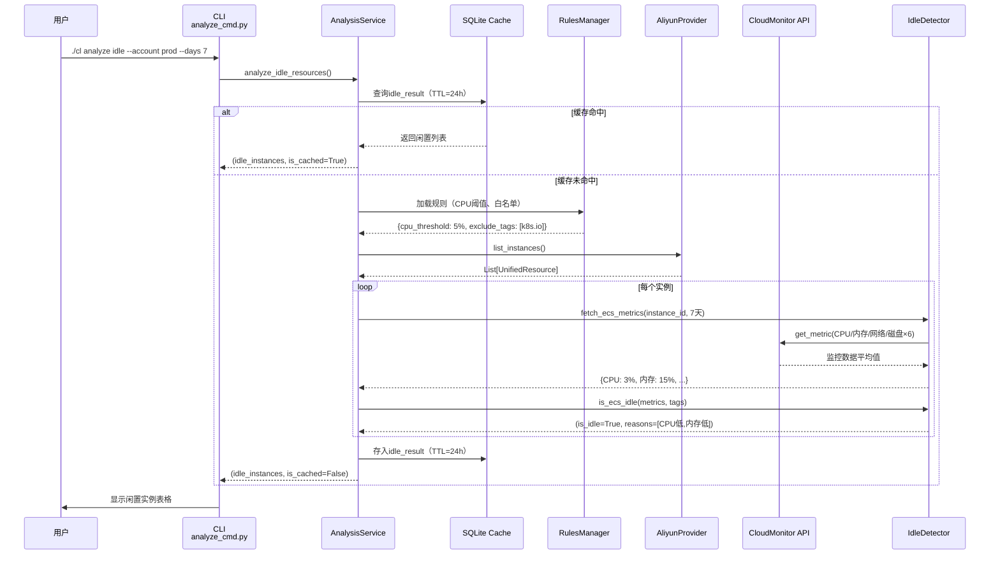

---

### 数据流3: 折扣趋势分析 ✨

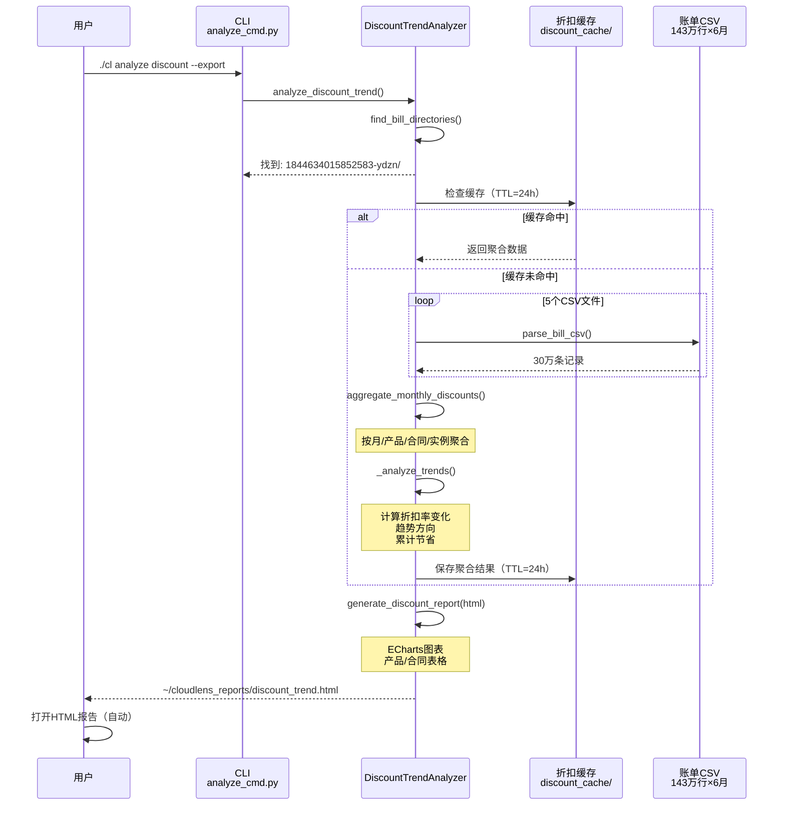

---

### 数据流4: Web Dashboard加载

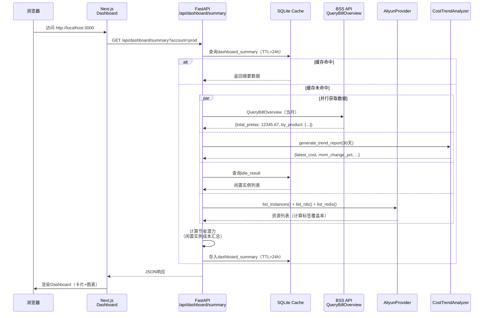

---

## 🗂️ 模块依赖关系图

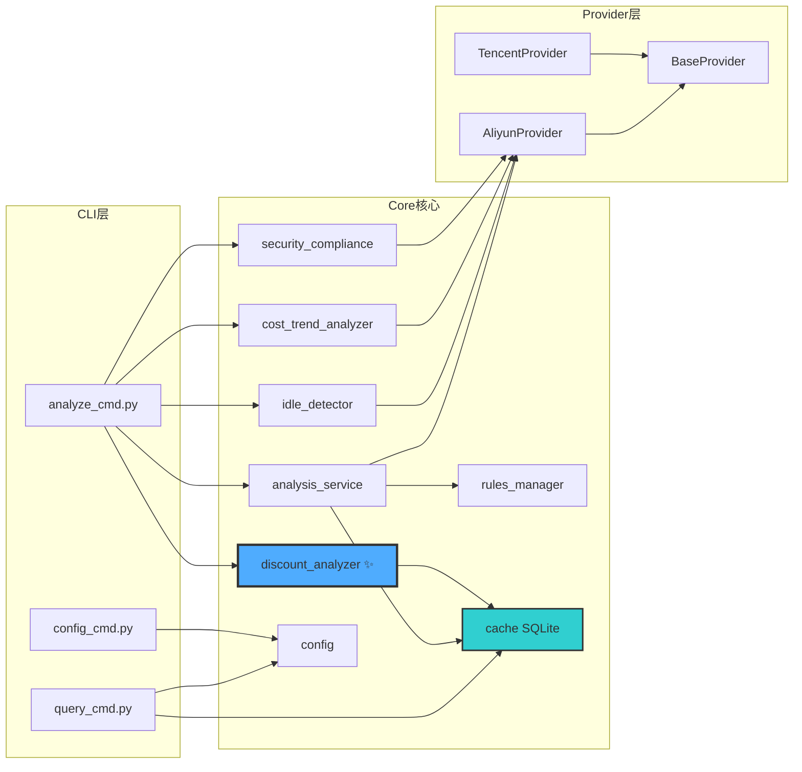

---

## 💾 数据存储拓扑图

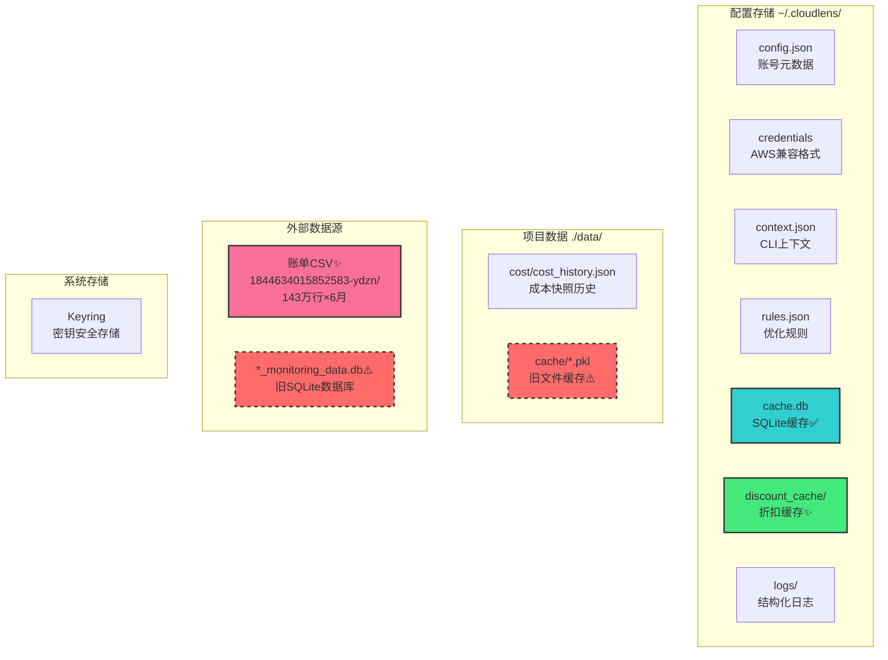

**图例**:
- 🟦 正常使用
- 🟩 新增功能
- 🟥 虚线框 = 待废弃/重构

---

## 🔄 折扣分析处理流程图

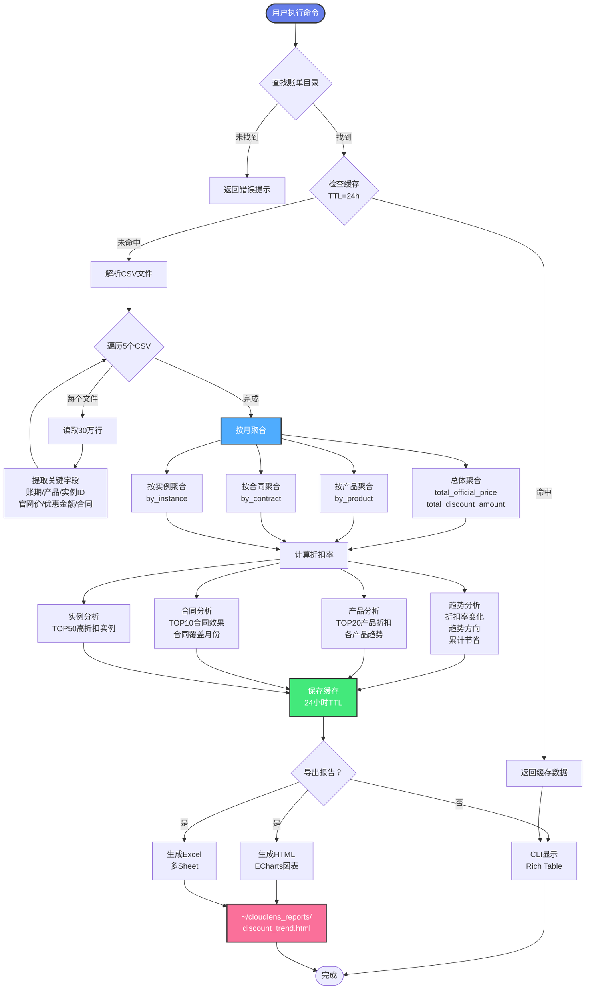

---

## 🎯 缓存策略图

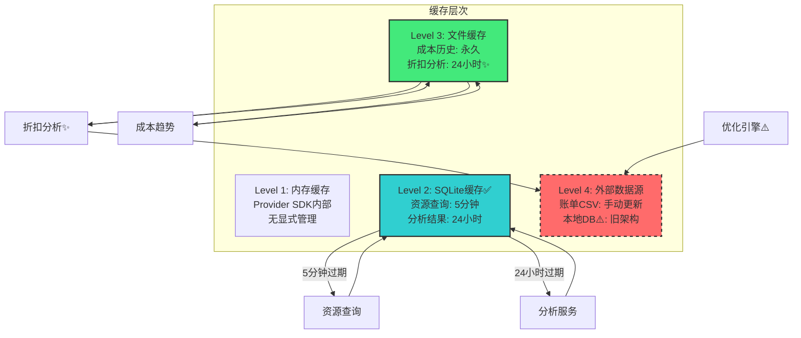

---

## 🔧 技术栈拓扑图

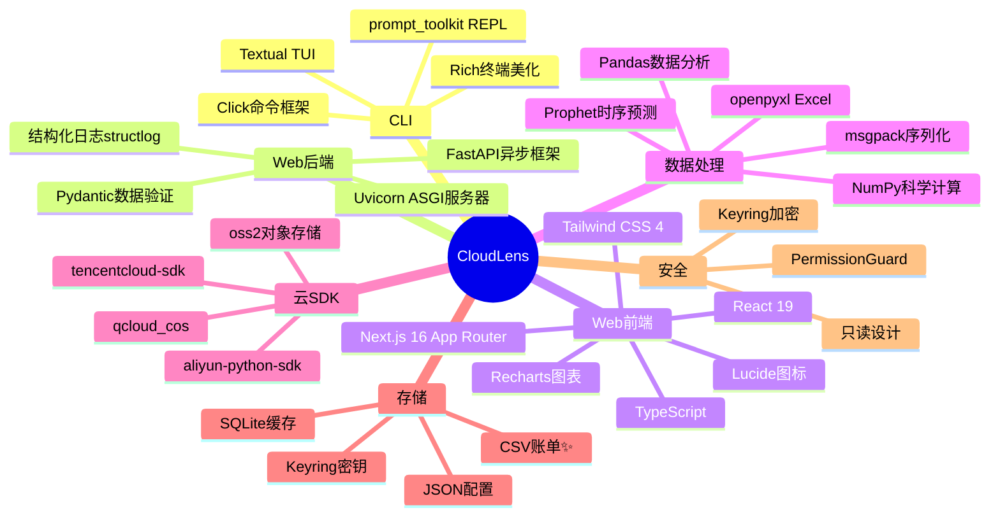

---

## 📦 资源类型支持矩阵

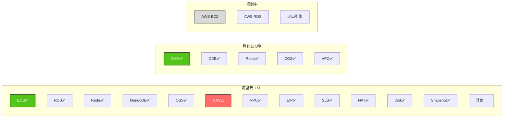

---

## 🎨 Web前端页面结构图

```mermaid
graph TB
    Root[/根路由<br/>Dashboard]
    
    Root --> Resources[/resources<br/>资源管理]
    Root --> Cost[/cost<br/>成本分析]
    Root --> Security[/security<br/>安全合规]
    Root --> Discounts[/discounts✨<br/>折扣分析]
    Root --> Optimization[/optimization<br/>优化建议]
    Root --> Reports[/reports<br/>报告生成]
    Root --> Settings[/settings<br/>设置]
    
    Resources --> ResDetail[/resources/[id]<br/>资源详情]
    
    Cost --> Budget[/cost/budget<br/>预算管理]
    
    Security --> CIS[/security/cis<br/>CIS合规]
    
    Discounts --> DiscountTrend[折扣率趋势图]
    Discounts --> ProductDiscount[产品折扣对比]
    Discounts --> ContractDiscount[合同效果分析]
    
    Settings --> Accounts[/settings/accounts<br/>账号管理]
    
    style Root fill:#667eea,stroke:#333,stroke-width:2px,color:#fff
    style Discounts fill:#4facfe,stroke:#333,stroke-width:3px,color:#fff
    style DiscountTrend fill:#43e97b,stroke:#333,stroke-width:2px
    style ProductDiscount fill:#43e97b,stroke:#333,stroke-width:2px
    style ContractDiscount fill:#43e97b,stroke:#333,stroke-width:2px
```

---

## 🔍 成本数据来源决策树

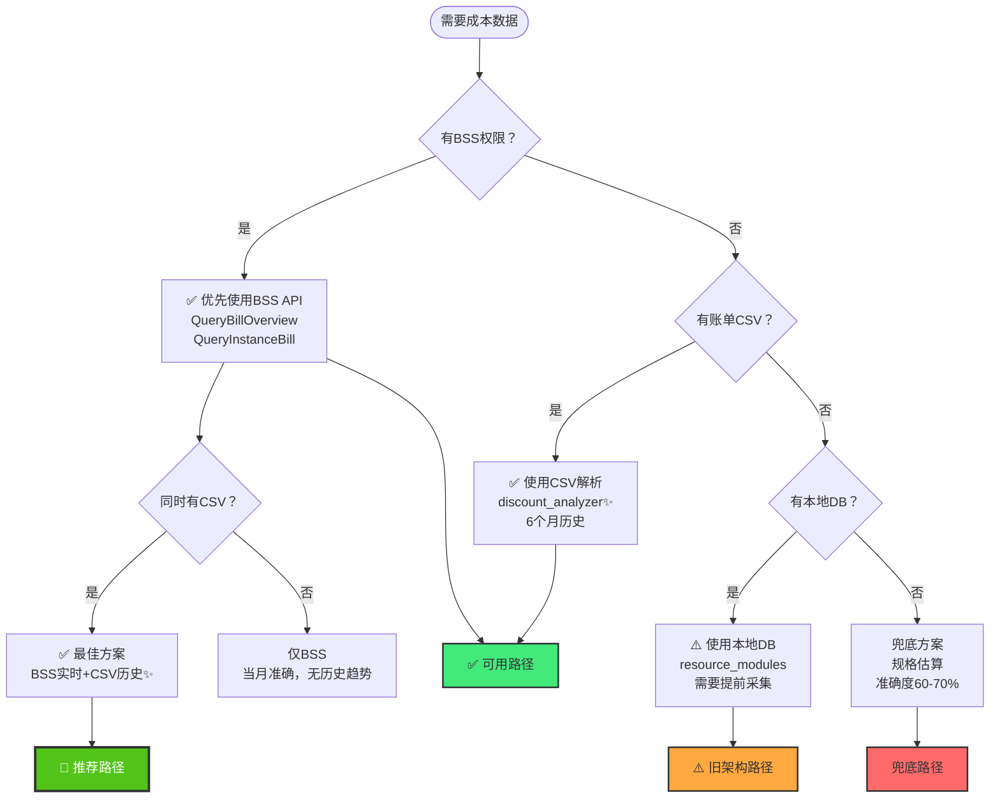

---

## 📋 技术债务分布图

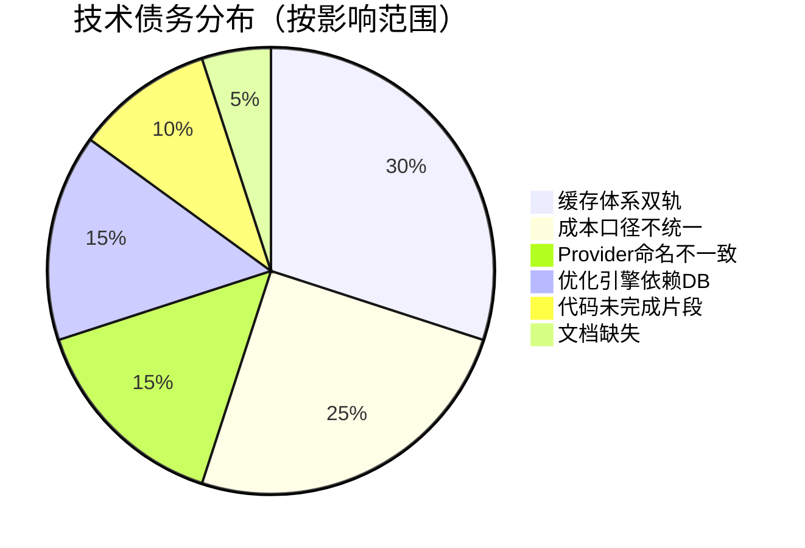

---

## 🎯 重构优先级象限图

```
高价值
  │
  │  🔴 P0              🟡 P1
  │  ┌──────────────────┬──────────────────┐
  │  │ • 修复list_nas   │ • 统一成本口径   │
  │  │ • 统一缓存命名   │ • 批量查询优化   │
  │  │ • 修复命名冲突   │ • 折扣数据集成   │
  │  └──────────────────┴──────────────────┘
  │  🟢 P3              🟢 P2
  │  ┌──────────────────┬──────────────────┐
  │  │ • 代码风格统一   │ • Web功能补全    │
  │  │ • 日志优化       │ • 文档完善       │
  │  │ • 性能监控       │ • 监控批量获取   │
  │  └──────────────────┴──────────────────┘
  │
  └──────────────────────────────────── 实现难度
     低                              高
```

---

## 🌟 产品演进路线图

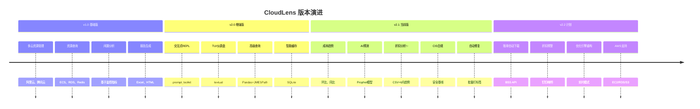

---

## 🎓 架构设计亮点

### 1. Provider抽象模式 ⭐⭐⭐⭐⭐

**优点**: 完美屏蔽云厂商差异，易于扩展

```python
# 添加新云厂商只需3步：
1. class AWSProvider(BaseProvider)
2. 实现必需接口
3. 注册到 get_provider()
```

### 2. 统一资源模型 ⭐⭐⭐⭐⭐

**优点**: 跨云资源可统一查询、分析、报告

```python
UnifiedResource:
  - 最小公共集（所有云都有的字段）
  - raw_data保存原始数据（扩展性）
  - 枚举类型（类型安全）
```

### 3. 多源配置加载 ⭐⭐⭐⭐

**优点**: 灵活适配不同环境（本地/CI/生产）

```
优先级: 环境变量 > credentials文件 > config.json + Keyring
```

### 4. 24小时智能缓存 ⭐⭐⭐⭐

**优点**: 平衡实时性和性能

```
资源查询: 5分钟（变化较快）
分析结果: 24小时（变化较慢）
```

### 5. CSV离线分析 ⭐⭐⭐⭐⭐ ✨

**优点**: 
- 无API权限依赖
- 支持6个月+历史
- 包含完整折扣明细

---

## 📞 快速导航

- **完整报告**: [PROJECT_DEEP_ANALYSIS.md](PROJECT_DEEP_ANALYSIS.md)
- **产品概览**: [PRODUCT_OVERVIEW.md](PRODUCT_OVERVIEW.md)
- **折扣指南**: [docs/DISCOUNT_ANALYSIS_GUIDE.md](docs/DISCOUNT_ANALYSIS_GUIDE.md) ✨
- **Web设计**: [WEB_PRODUCT_DESIGN.md](WEB_PRODUCT_DESIGN.md)

---

**最后更新**: 2025-12-15  
**梳理状态**: ✅ 完成  
**新增功能**: ✨ 折扣趋势分析已集成
