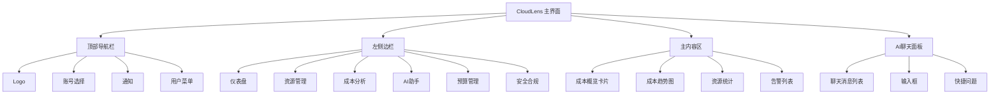
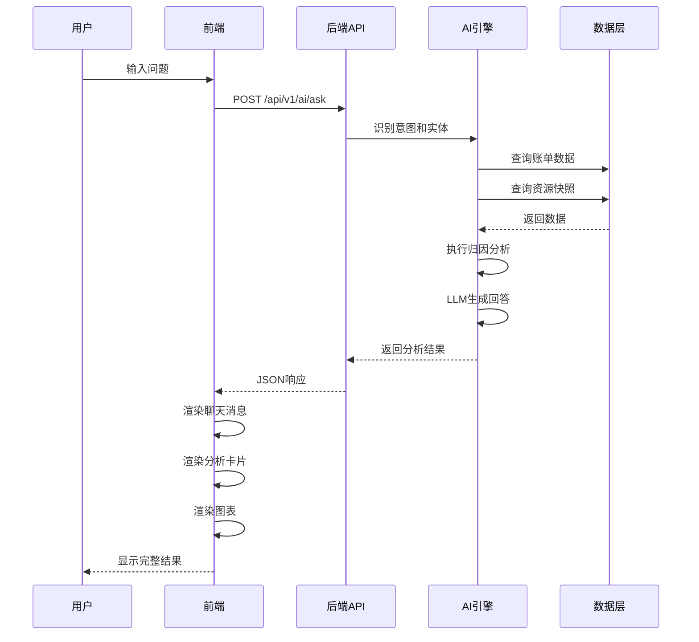
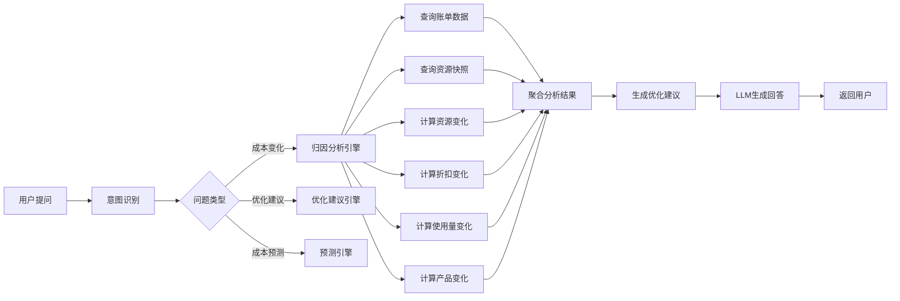

# CloudLens 2026 产品设计图

**设计日期**: 2026-01-16  
**版本**: 1.0.0  
**基于**: DEVELOPMENT_PLAN_2026_CURSOR.md

---

## 📋 设计图目录

1. [AI聊天界面设计](#1-ai聊天界面设计)
2. [成本归因分析结果页](#2-成本归因分析结果页)
3. [成本变化分析报告](#3-成本变化分析报告)
4. [优化建议卡片](#4-优化建议卡片)
5. [成本预测仪表盘](#5-成本预测仪表盘)
6. [移动端适配设计](#6-移动端适配设计)

---

## 1. AI聊天界面设计

### 1.1 桌面端聊天界面

```
┌─────────────────────────────────────────────────────────────────┐
│  CloudLens - 智能成本分析师                    [账号: test ▼]  │
├─────────────────────────────────────────────────────────────────┤
│                                                                 │
│  ┌─────────────────────────────────────────────────────────┐  │
│  │  💬 成本分析助手                                          │  │
│  │                                                           │  │
│  │  你好！我是CloudLens的AI成本分析师，可以帮你：            │  │
│  │  • 分析成本变化原因                                       │  │
│  │  • 提供优化建议                                           │  │
│  │  • 预测未来成本趋势                                       │  │
│  │                                                           │  │
│  │  试试问我："这个月费用为什么比上个月高了？"              │  │
│  └─────────────────────────────────────────────────────────┘  │
│                                                                 │
│  ┌─────────────────────────────────────────────────────────┐  │
│  │ 👤 用户                                                   │  │
│  │                                                           │  │
│  │  这个月费用为什么比上个月高了？                           │  │
│  │                                    [2026-01-16 14:30]    │  │
│  └─────────────────────────────────────────────────────────┘  │
│                                                                 │
│  ┌─────────────────────────────────────────────────────────┐  │
│  │ 🤖 AI助手                    [正在分析...]                │  │
│  │                                                           │  │
│  │  📊 成本变化分析报告 (2026-01 vs 2025-12)                │  │
│  │                                                           │  │
│  │  本月总成本：¥125,000 (环比 +23.5%)                      │  │
│  │                                                           │  │
│  │  ┌─────────────────────────────────────────────────┐    │  │
│  │  │ 主要原因分析：                                   │    │  │
│  │  │                                                 │    │  │
│  │  │  1. 🔴 资源数量增加 (影响: +¥18,000, 占比: 72%)│    │  │
│  │  │     • ECS实例：新增 10 台                        │    │  │
│  │  │     • RDS实例：新增 2 台                         │    │  │
│  │  │                                                 │    │  │
│  │  │  2. 🟡 折扣率下降 (影响: +¥4,500, 占比: 18%)    │    │  │
│  │  │     • ECS折扣：从 85% → 78%                     │    │  │
│  │  │                                                 │    │  │
│  │  │  3. 🟢 使用量增长 (影响: +¥2,000, 占比: 8%)    │    │  │
│  │  │     • OSS存储：从 2.5TB → 3.1TB                 │    │  │
│  │  └─────────────────────────────────────────────────┘    │  │
│  │                                                           │  │
│  │  💡 优化建议：                                           │  │
│  │  1. 续购预留实例，恢复折扣率 → 预计节省 ¥3,200/月       │  │
│  │  2. 评估新增资源必要性 → 预计节省 ¥8,000/月             │  │
│  │                                                           │  │
│  │  [查看详细报告] [查看图表] [执行优化]                    │  │
│  │                                    [2026-01-16 14:30]    │  │
│  └─────────────────────────────────────────────────────────┘  │
│                                                                 │
│  ┌─────────────────────────────────────────────────────────┐  │
│  │ 👤 用户                                                   │  │
│  │                                                           │  │
│  │  哪些新增的资源可以优化？                                 │  │
│  │                                    [2026-01-16 14:32]    │  │
│  └─────────────────────────────────────────────────────────┘  │
│                                                                 │
│  ┌─────────────────────────────────────────────────────────┐  │
│  │ 🤖 AI助手                                                 │  │
│  │                                                           │  │
│  │  根据分析，以下新增资源可以优化：                         │  │
│  │                                                           │  │
│  │  ┌─────────────────────────────────────────────────┐    │  │
│  │  │ 📋 可优化资源列表                                 │    │  │
│  │  │                                                 │    │  │
│  │  │  ✓ i-ecs-001  [华东1]  ECS 2核4G              │    │  │
│  │  │     创建时间: 2026-01-05                        │    │  │
│  │  │     CPU使用率: 3% (闲置)                        │    │  │
│  │  │     预计节省: ¥800/月                          │    │  │
│  │  │     [查看详情] [标记优化]                       │    │  │
│  │  │                                                 │    │  │
│  │  │  ✓ i-ecs-002  [华东2]  ECS 4核8G              │    │  │
│  │  │     创建时间: 2026-01-08                        │    │  │
│  │  │     CPU使用率: 8% (低使用)                      │    │  │
│  │  │     预计节省: ¥1,200/月                        │    │  │
│  │  │     [查看详情] [标记优化]                       │    │  │
│  │  └─────────────────────────────────────────────────┘    │  │
│  │                                                           │  │
│  │  总计可优化：¥8,000/月                                   │  │
│  │  [批量优化] [生成优化报告]                               │  │
│  │                                    [2026-01-16 14:32]    │  │
│  └─────────────────────────────────────────────────────────┘  │
│                                                                 │
├─────────────────────────────────────────────────────────────────┤
│  💡 快捷问题:                                                   │
│  [这个月费用为什么比上个月高了？] [哪些资源可以优化？]          │
│  [按这个趋势，本月会超预算吗？] [帮我生成成本分析报告]          │
├─────────────────────────────────────────────────────────────────┤
│  ┌─────────────────────────────────────────────────────────┐  │
│  │ 问我任何关于成本的问题...                    [发送] [🎤] │  │
│  └─────────────────────────────────────────────────────────┘  │
└─────────────────────────────────────────────────────────────────┘
```

### 1.2 界面元素说明

**左侧边栏**（可选）:
- 历史对话列表
- 常用问题模板
- 收藏的分析报告

**主聊天区域**:
- 消息气泡样式
- 用户消息：右对齐，蓝色背景
- AI消息：左对齐，白色背景，支持富文本
- 时间戳显示
- 加载状态指示器

**输入区域**:
- 多行文本输入框
- 快捷问题按钮
- 语音输入按钮（可选）
- 发送按钮

**AI消息增强功能**:
- 可展开的详细分析卡片
- 交互式图表
- 一键操作按钮（查看详情、执行优化等）
- 后续问题建议

---

## 2. 成本归因分析结果页

### 2.1 完整分析页面

```
┌─────────────────────────────────────────────────────────────────┐
│  ← 返回   成本变化分析报告                    [导出报告] [分享] │
├─────────────────────────────────────────────────────────────────┤
│                                                                 │
│  📊 成本变化分析 (2026-01 vs 2025-12)                          │
│                                                                 │
│  ┌─────────────────────────────────────────────────────────┐  │
│  │                   总成本变化概览                          │  │
│  │                                                           │  │
│  │        上月: ¥101,000         本月: ¥125,000             │  │
│  │                                                           │  │
│  │              ┌──────────────┐                            │  │
│  │              │  +¥24,000    │                            │  │
│  │              │   +23.5%     │                            │  │
│  │              └──────────────┘                            │  │
│  │                                                           │  │
│  │  [环比] [同比] [自定义对比]                               │  │
│  └─────────────────────────────────────────────────────────┘  │
│                                                                 │
│  ┌─────────────────────────────────────────────────────────┐  │
│  │                   成本变化归因                           │  │
│  │                                                           │  │
│  │  ┌─────────────────────────────────────────────────┐    │  │
│  │  │ 1. 🔴 资源数量增加                               │    │  │
│  │  │    影响金额: +¥18,000  |  占比: 72%              │    │  │
│  │  │    ┌─────────────────────────────────────────┐  │    │  │
│  │  │    │ ECS实例变化:                            │  │    │  │
│  │  │    │   上月: 45台  →  本月: 55台  (+10台)    │  │    │  │
│  │  │    │   新增成本: ¥12,000/月                  │  │    │  │
│  │  │    │   主要区域: 华东1(6台), 华东2(4台)       │  │    │  │
│  │  │    │   [查看新增实例列表]                     │  │    │  │
│  │  │    └─────────────────────────────────────────┘  │    │  │
│  │  │    ┌─────────────────────────────────────────┐  │    │  │
│  │  │    │ RDS实例变化:                            │  │    │  │
│  │  │    │   上月: 8台  →  本月: 10台  (+2台)      │  │    │  │
│  │  │    │   新增成本: ¥6,000/月                   │  │    │  │
│  │  │    │   实例类型: MySQL 8.0 高可用版          │  │    │  │
│  │  │    │   [查看新增实例列表]                     │  │    │  │
│  │  │    └─────────────────────────────────────────┘  │    │  │
│  │  └─────────────────────────────────────────────────┘    │  │
│  │                                                           │  │
│  │  ┌─────────────────────────────────────────────────┐    │  │
│  │  │ 2. 🟡 折扣率下降                                 │    │  │
│  │  │    影响金额: +¥4,500  |  占比: 18%              │    │  │
│  │  │    ┌─────────────────────────────────────────┐  │    │  │
│  │  │    │ ECS包年包月折扣:                         │  │    │  │
│  │  │    │   上月: 85%  →  本月: 78%  (下降7%)      │  │    │  │
│  │  │    │   影响成本: ¥3,200                       │  │    │  │
│  │  │    │   原因: 部分预留实例到期，转为按量付费   │  │    │  │
│  │  │    │   [查看折扣趋势图] [续购预留实例]        │  │    │  │
│  │  │    └─────────────────────────────────────────┘  │    │  │
│  │  │    ┌─────────────────────────────────────────┐  │    │  │
│  │  │    │ RDS折扣:                                 │  │    │  │
│  │  │    │   上月: 82%  →  本月: 75%  (下降7%)      │  │    │  │
│  │  │    │   影响成本: ¥1,300                       │  │    │  │
│  │  │    │   原因: 新购实例未享受折扣               │  │    │  │
│  │  │    │   [查看折扣趋势图]                       │  │    │  │
│  │  │    └─────────────────────────────────────────┘  │    │  │
│  │  └─────────────────────────────────────────────────┘    │  │
│  │                                                           │  │
│  │  ┌─────────────────────────────────────────────────┐    │  │
│  │  │ 3. 🟢 使用量增长                                 │    │  │
│  │  │    影响金额: +¥2,000  |  占比: 8%               │    │  │
│  │  │    ┌─────────────────────────────────────────┐  │    │  │
│  │  │    │ OSS存储:                                │  │    │  │
│  │  │    │   上月: 2.5TB  →  本月: 3.1TB  (+24%)    │  │    │  │
│  │  │    │   存储费用: +¥1,200                      │  │    │  │
│  │  │    │   [查看存储详情] [优化建议]              │  │    │  │
│  │  │    └─────────────────────────────────────────┘  │    │  │
│  │  │    ┌─────────────────────────────────────────┐  │    │  │
│  │  │    │ CDN流量:                                │  │    │  │
│  │  │    │   上月: 500GB  →  本月: 650GB  (+30%)    │  │    │  │
│  │  │    │   流量费用: +¥800                       │  │    │  │
│  │  │    │   [查看流量详情] [优化建议]              │  │    │  │
│  │  │    └─────────────────────────────────────────┘  │    │  │
│  │  └─────────────────────────────────────────────────┘    │  │
│  │                                                           │  │
│  │  ┌─────────────────────────────────────────────────┐    │  │
│  │  │ 4. ⚪ 价格变化                                  │    │  │
│  │  │    影响金额: +¥500  |  占比: 2%                │    │  │
│  │  │    部分产品价格微调                             │    │  │
│  │  └─────────────────────────────────────────────────┘    │  │
│  └─────────────────────────────────────────────────────────┘  │
│                                                                 │
│  ┌─────────────────────────────────────────────────────────┐  │
│  │                   可视化图表                               │  │
│  │                                                           │  │
│  │  ┌─────────────────────────────────────────────────┐    │  │
│  │  │  成本变化归因饼图                                │    │  │
│  │  │                                                 │    │  │
│  │  │        ┌─────┐                                 │    │  │
│  │  │       ╱  72% ╲                                │    │  │
│  │  │      ╱ 资源  ╲                                │    │  │
│  │  │     │  增加  │                                 │    │  │
│  │  │      ╲       ╱                                │    │  │
│  │  │       ╲─────╱                                 │    │  │
│  │  │    18%折扣  8%使用量  2%价格                  │    │  │
│  │  │                                                 │    │  │
│  │  └─────────────────────────────────────────────────┘    │  │
│  │                                                           │  │
│  │  ┌─────────────────────────────────────────────────┐    │  │
│  │  │  成本趋势对比图                                    │    │  │
│  │  │                                                 │    │  │
│  │  │  成本(¥)                                        │    │  │
│  │  │   130k ┤                                        │    │  │
│  │  │   125k ┤                    ●                  │    │  │
│  │  │   120k ┤              ●                          │    │  │
│  │  │   115k ┤        ●                                │    │  │
│  │  │   110k ┤  ●                                      │    │  │
│  │  │   105k ┤                                          │    │  │
│  │  │   100k ┤                                          │    │  │
│  │  │         └────┬────┬────┬────┬────┬────┬────┐    │    │  │
│  │  │           12月  1月  2月  3月  4月  5月  6月    │    │  │
│  │  │                                                 │    │  │
│  │  │  蓝色: 上月  红色: 本月                         │    │  │
│  │  └─────────────────────────────────────────────────┘    │  │
│  └─────────────────────────────────────────────────────────┘  │
│                                                                 │
└─────────────────────────────────────────────────────────────────┘
```

### 2.2 交互功能

- **钻取功能**: 点击任意归因项，查看详细数据
- **时间对比切换**: 支持环比、同比、自定义对比
- **图表交互**: 悬停显示详细数据，点击切换图表类型
- **导出功能**: 导出为PDF/Excel/HTML报告

---

## 3. 成本变化分析报告

### 3.1 报告页面布局

```
┌─────────────────────────────────────────────────────────────────┐
│  成本变化分析报告 - 2026年1月                    [打印] [PDF]   │
├─────────────────────────────────────────────────────────────────┤
│                                                                 │
│  ┌─────────────────────────────────────────────────────────┐  │
│  │                   执行摘要                                │  │
│  │                                                           │  │
│  │  报告时间: 2026-01-16                                     │  │
│  │  分析账期: 2026-01 vs 2025-12                            │  │
│  │  账号: test (测试账号)                                    │  │
│  │                                                           │  │
│  │  核心发现:                                               │  │
│  │  • 本月总成本: ¥125,000，环比增长 23.5%                  │  │
│  │  • 主要驱动因素: 资源数量增加 (72%)                      │  │
│  │  • 优化潜力: ¥11,700/月 (占增长成本的47%)                │  │
│  └─────────────────────────────────────────────────────────┘  │
│                                                                 │
│  ┌─────────────────────────────────────────────────────────┐  │
│  │                   详细分析                                │  │
│  │                                                           │  │
│  │  1. 资源数量变化分析                                      │  │
│  │     [详细数据表格]                                        │  │
│  │                                                           │  │
│  │  2. 折扣率变化分析                                        │  │
│  │     [折扣趋势图表]                                        │  │
│  │                                                           │  │
│  │  3. 使用量变化分析                                        │  │
│  │     [使用量对比图表]                                      │  │
│  │                                                           │  │
│  │  4. 产品变化分析                                          │  │
│  │     [产品清单表格]                                        │  │
│  └─────────────────────────────────────────────────────────┘  │
│                                                                 │
│  ┌─────────────────────────────────────────────────────────┐  │
│  │                   优化建议                                │  │
│  │                                                           │  │
│  │  ┌─────────────────────────────────────────────────┐    │  │
│  │  │ 🔴 高优先级                                        │    │  │
│  │  │                                                   │    │  │
│  │  │ 建议1: 续购预留实例                               │    │  │
│  │  │ • 问题: 部分预留实例到期，折扣率下降7%             │    │  │
│  │  │ • 行动: 立即续购即将到期的预留实例                 │    │  │
│  │  │ • 预计节省: ¥3,200/月                             │    │  │
│  │  │ • 执行难度: 低                                      │    │  │
│  │  │ • ROI: 高                                         │    │  │
│  │  │ [查看详情] [立即执行]                              │    │  │
│  │  └─────────────────────────────────────────────────┘    │  │
│  │                                                           │  │
│  │  ┌─────────────────────────────────────────────────┐    │  │
│  │  │ 🟡 中优先级                                        │    │  │
│  │  │                                                   │    │  │
│  │  │ 建议2: 评估新增资源必要性                          │    │  │
│  │  │ • 问题: 本月新增10台ECS实例，部分可能闲置          │    │  │
│  │  │ • 行动: 评估新增实例使用情况，考虑释放闲置实例      │    │  │
│  │  │ • 预计节省: ¥8,000/月                             │    │  │
│  │  │ • 执行难度: 中                                      │    │  │
│  │  │ • ROI: 高                                         │    │  │
│  │  │ [查看详情] [标记待优化]                            │    │  │
│  │  └─────────────────────────────────────────────────┘    │  │
│  │                                                           │  │
│  │  ┌─────────────────────────────────────────────────┐    │  │
│  │  │ 🟢 低优先级                                        │    │  │
│  │  │                                                   │    │  │
│  │  │ 建议3: 优化OSS存储                                │    │  │
│  │  │ • 问题: OSS存储增长24%，可能存在过期数据          │    │  │
│  │  │ • 行动: 清理过期数据，启用生命周期管理             │    │  │
│  │  │ • 预计节省: ¥500/月                               │    │  │
│  │  │ • 执行难度: 低                                      │    │  │
│  │  │ • ROI: 中                                         │    │  │
│  │  │ [查看详情] [设置生命周期规则]                      │    │  │
│  │  └─────────────────────────────────────────────────┘    │  │
│  └─────────────────────────────────────────────────────────┘  │
│                                                                 │
│  ┌─────────────────────────────────────────────────────────┐  │
│  │                   附录                                    │  │
│  │                                                           │  │
│  │  • 数据来源说明                                           │  │
│  │  • 分析方法说明                                           │  │
│  │  • 术语表                                                 │  │
│  └─────────────────────────────────────────────────────────┘  │
│                                                                 │
└─────────────────────────────────────────────────────────────────┘
```

---

## 4. 优化建议卡片

### 4.1 建议卡片设计

```
┌─────────────────────────────────────────────────────────────────┐
│  💡 智能优化建议                          [按优先级] [按节省]   │
├─────────────────────────────────────────────────────────────────┤
│                                                                 │
│  ┌─────────────────────────────────────────────────────────┐  │
│  │ 🔴 高优先级 | 预计节省: ¥3,200/月 | ROI: 高            │  │
│  ├─────────────────────────────────────────────────────────┤
│  │                                                           │  │
│  │  📌 续购预留实例                                          │  │
│  │                                                           │  │
│  │  📊 问题分析:                                             │  │
│  │  • 部分预留实例到期，折扣率从85%降至78%                   │  │
│  │  • 影响成本: ¥3,200/月                                   │  │
│  │  • 涉及实例: 8台ECS实例                                   │  │
│  │                                                           │  │
│  │  💰 优化效果:                                            │  │
│  │  • 预计节省: ¥3,200/月                                   │  │
│  │  • 执行成本: 低 (仅需续购操作)                           │  │
│  │  • 投资回报: 立即生效                                    │  │
│  │                                                           │  │
│  │  📋 执行步骤:                                             │  │
│  │  1. 查看即将到期的预留实例列表                           │  │
│  │  2. 选择需要续购的实例                                   │  │
│  │  3. 确认续购配置（时长、规格）                           │  │
│  │  4. 提交续购订单                                         │  │
│  │                                                           │  │
│  │  ⚠️  注意事项:                                           │  │
│  │  • 续购后立即生效，无需等待                               │  │
│  │  • 建议续购1年，享受最大折扣                             │  │
│  │                                                           │  │
│  │  [查看详情] [立即执行] [稍后提醒]                        │  │
│  └─────────────────────────────────────────────────────────┘  │
│                                                                 │
│  ┌─────────────────────────────────────────────────────────┐  │
│  │ 🟡 中优先级 | 预计节省: ¥8,000/月 | ROI: 高              │  │
│  ├─────────────────────────────────────────────────────────┤
│  │                                                           │  │
│  │  📌 评估新增资源必要性                                    │  │
│  │                                                           │  │
│  │  📊 问题分析:                                             │  │
│  │  • 本月新增10台ECS实例，部分可能闲置                     │  │
│  │  • 新增成本: ¥12,000/月                                  │  │
│  │  • 闲置风险: 3台实例CPU使用率<5%                         │  │
│  │                                                           │  │
│  │  💰 优化效果:                                            │  │
│  │  • 预计节省: ¥8,000/月 (释放闲置实例)                    │  │
│  │  • 执行成本: 中 (需评估业务影响)                          │  │
│  │  • 投资回报: 1周内见效                                   │  │
│  │                                                           │  │
│  │  📋 执行步骤:                                             │  │
│  │  1. 查看新增实例使用情况                                 │  │
│  │  2. 识别闲置/低使用率实例                                │  │
│  │  3. 与业务团队确认是否可以释放                           │  │
│  │  4. 执行释放操作（需审批）                               │  │
│  │                                                           │  │
│  │  ⚠️  注意事项:                                           │  │
│  │  • 释放前务必确认业务影响                                │  │
│  │  • 建议先停机观察，确认无影响后再释放                    │  │
│  │                                                           │  │
│  │  [查看详情] [标记待优化] [生成评估报告]                  │  │
│  └─────────────────────────────────────────────────────────┘  │
│                                                                 │
│  ┌─────────────────────────────────────────────────────────┐  │
│  │                   优化建议汇总                            │  │
│  │                                                           │  │
│  │  总计可优化: ¥11,700/月                                  │  │
│  │  • 高优先级: ¥3,200/月 (1项)                             │  │
│  │  • 中优先级: ¥8,000/月 (1项)                            │  │
│  │  • 低优先级: ¥500/月 (1项)                               │  │
│  │                                                           │  │
│  │  [批量执行] [生成优化计划] [导出报告]                    │  │
│  └─────────────────────────────────────────────────────────┘  │
│                                                                 │
└─────────────────────────────────────────────────────────────────┘
```

---

## 5. 成本预测仪表盘

### 5.1 预测分析页面

```
┌─────────────────────────────────────────────────────────────────┐
│  成本预测分析                    [基准] [优化] [扩容] [自定义]  │
├─────────────────────────────────────────────────────────────────┤
│                                                                 │
│  ┌─────────────────────────────────────────────────────────┐  │
│  │                   预测概览                                │  │
│  │                                                           │  │
│  │  预测周期: 未来90天                                       │  │
│  │  模型: Prophet (准确度: 87%)                             │  │
│  │  数据来源: 最近12个月历史数据                            │  │
│  │                                                           │  │
│  │  ┌─────────────────────────────────────────────────┐    │  │
│  │  │  预测总成本: ¥3,750,000                           │    │  │
│  │  │  置信区间: ¥3,540,000 - ¥3,960,000               │    │  │
│  │  │  日均成本: ¥41,667                               │    │  │
│  │  │  环比增长: +15.2%                                │    │  │
│  │  └─────────────────────────────────────────────────┘    │  │
│  └─────────────────────────────────────────────────────────┘  │
│                                                                 │
│  ┌─────────────────────────────────────────────────────────┐  │
│  │                   预测趋势图                              │  │
│  │                                                           │  │
│  │  成本(¥)                                                  │  │
│  │   150k ┤                                                  │  │
│  │   140k ┤                                                  │  │
│  │   130k ┤                                                  │  │
│  │   120k ┤                                                  │  │
│  │   110k ┤                                                  │  │
│  │   100k ┤                                                  │  │
│  │    90k ┤                                                  │  │
│  │    80k ┤                                                  │  │
│  │         └────┬────┬────┬────┬────┬────┬────┬────┐      │  │
│  │           1月  2月  3月  4月  5月  6月  7月  8月        │  │
│  │                                                           │  │
│  │  蓝色实线: 历史数据                                       │  │
│  │  红色实线: 预测值                                         │  │
│  │  红色阴影: 95%置信区间                                    │  │
│  │  黄色虚线: 预算线 (¥120,000/月)                          │  │
│  │                                                           │  │
│  │  ⚠️  预警: 预计2月15日将超预算                            │  │
│  └─────────────────────────────────────────────────────────┘  │
│                                                                 │
│  ┌─────────────────────────────────────────────────────────┐  │
│  │                   场景对比                                │  │
│  │                                                           │  │
│  │  ┌──────────────┐  ┌──────────────┐  ┌──────────────┐  │  │
│  │  │ 基准场景      │  │ 优化场景      │  │ 扩容场景      │  │  │
│  │  │              │  │              │  │              │  │  │
│  │  │ 预测成本:     │  │ 预测成本:     │  │ 预测成本:     │  │  │
│  │  │ ¥3,750,000   │  │ ¥3,200,000   │  │ ¥4,200,000   │  │  │
│  │  │              │  │              │  │              │  │  │
│  │  │ 日均:        │  │ 日均:        │  │ 日均:        │  │  │
│  │  │ ¥41,667     │  │ ¥35,556     │  │ ¥46,667     │  │  │
│  │  │              │  │              │  │              │  │  │
│  │  │ 节省: -      │  │ 节省:        │  │ 增加:        │  │  │
│  │  │              │  │ ¥550,000    │  │ ¥450,000    │  │  │
│  │  │              │  │ (15%)       │  │ (+12%)      │  │  │
│  │  │              │  │              │  │              │  │  │
│  │  │ [查看详情]    │  │ [查看详情]    │  │ [查看详情]    │  │  │
│  │  └──────────────┘  └──────────────┘  └──────────────┘  │  │
│  └─────────────────────────────────────────────────────────┘  │
│                                                                 │
│  ┌─────────────────────────────────────────────────────────┐  │
│  │                   风险提示                                │  │
│  │                                                           │  │
│  │  🔴 预算超支风险                                          │  │
│  │  • 按当前趋势，预计2月15日将超预算                        │  │
│  │  • 超支金额: 约¥15,000                                   │  │
│  │  • 建议: 立即执行优化措施，或调整预算                    │  │
│  │  [查看优化建议] [调整预算]                               │  │
│  │                                                           │  │
│  │  🟡 成本增长趋势                                          │  │
│  │  • 预测显示成本将持续增长                                │  │
│  │  • 主要驱动: 资源数量增加                                │  │
│  │  • 建议: 评估新增资源必要性                              │  │
│  │  [查看资源分析]                                           │  │
│  └─────────────────────────────────────────────────────────┘  │
│                                                                 │
└─────────────────────────────────────────────────────────────────┘
```

---

## 6. 移动端适配设计

### 6.1 移动端聊天界面

```
┌─────────────────────────┐
│ ☰  CloudLens    [账号▼] │
├─────────────────────────┤
│                         │
│ ┌─────────────────────┐ │
│ │ 💬 成本分析助手      │ │
│ │                     │ │
│ │ 你好！我是AI成本     │ │
│ │ 分析师...           │ │
│ └─────────────────────┘ │
│                         │
│ ┌─────────────────────┐ │
│ │ 👤 用户              │ │
│ │                     │ │
│ │ 这个月费用为什么     │ │
│ │ 比上个月高了？       │ │
│ └─────────────────────┘ │
│                         │
│ ┌─────────────────────┐ │
│ │ 🤖 AI助手            │ │
│ │                     │ │
│ │ 📊 成本变化分析      │ │
│ │                     │ │
│ │ 本月: ¥125,000      │ │
│ │ 环比: +23.5%        │ │
│ │                     │ │
│ │ 主要原因:            │ │
│ │ 1. 资源增加 (72%)    │ │
│ │ 2. 折扣下降 (18%)    │ │
│ │ 3. 使用量增长 (8%)   │ │
│ │                     │ │
│ │ [查看详细] [优化建议]│ │
│ └─────────────────────┘ │
│                         │
│ ┌─────────────────────┐ │
│ │ 💡 快捷问题          │ │
│ │                     │ │
│ │ [费用为什么高了？]   │ │
│ │ [哪些资源可优化？]   │ │
│ │ [会超预算吗？]       │ │
│ └─────────────────────┘ │
│                         │
├─────────────────────────┤
│ ┌─────────────────────┐ │
│ │ 问我任何问题...      │ │
│ │              [发送]  │ │
│ └─────────────────────┘ │
└─────────────────────────┘
```

### 6.2 移动端分析卡片

```
┌─────────────────────────┐
│ ← 返回   成本分析        │
├─────────────────────────┤
│                         │
│ ┌─────────────────────┐ │
│ │ 总成本变化           │ │
│ │                     │ │
│ │ 上月: ¥101,000      │ │
│ │ 本月: ¥125,000      │ │
│ │                     │ │
│ │    +¥24,000         │ │
│ │    +23.5%           │ │
│ └─────────────────────┘ │
│                         │
│ ┌─────────────────────┐ │
│ │ 🔴 资源数量增加      │ │
│ │                     │ │
│ │ 影响: +¥18,000      │ │
│ │ 占比: 72%           │ │
│ │                     │ │
│ │ ECS: +10台          │ │
│ │ RDS: +2台           │ │
│ │                     │ │
│ │ [查看详情]          │ │
│ └─────────────────────┘ │
│                         │
│ ┌─────────────────────┐ │
│ │ 🟡 折扣率下降        │ │
│ │                     │ │
│ │ 影响: +¥4,500       │ │
│ │ 占比: 18%           │ │
│ │                     │ │
│ │ ECS: 85%→78%        │ │
│ │ RDS: 82%→75%        │ │
│ │                     │ │
│ │ [查看详情]          │ │
│ └─────────────────────┘ │
│                         │
│ ┌─────────────────────┐ │
│ │ 💡 优化建议          │ │
│ │                     │ │
│ │ 1. 续购预留实例      │ │
│ │    节省: ¥3,200/月  │ │
│ │                     │ │
│ │ 2. 评估新增资源      │ │
│ │    节省: ¥8,000/月  │ │
│ │                     │ │
│ │ [查看全部]          │ │
│ └─────────────────────┘ │
│                         │
└─────────────────────────┘
```

---

## 7. 设计规范

### 7.1 颜色规范

- **主色调**: 
  - 品牌蓝: #1890FF (主要操作、链接)
  - 成功绿: #52C41A (正面数据、成功状态)
  - 警告橙: #FA8C16 (中等影响、警告)
  - 错误红: #F5222D (高影响、错误、危险操作)

- **中性色**:
  - 文本主色: #262626
  - 文本次色: #595959
  - 边框色: #D9D9D9
  - 背景色: #FAFAFA

### 7.2 字体规范

- **标题**: 18px/20px, 粗体
- **正文**: 14px, 常规
- **辅助文本**: 12px, 常规
- **数字**: 16px/20px, 中等粗细

### 7.3 间距规范

- **卡片内边距**: 16px/24px
- **卡片间距**: 16px
- **元素间距**: 8px/12px/16px

### 7.4 交互规范

- **按钮**: 最小点击区域 44x44px
- **悬停效果**: 所有可点击元素
- **加载状态**: 骨架屏 + 加载动画
- **错误处理**: 友好的错误提示 + 重试按钮

---

## 8. 用户流程

### 8.1 成本归因分析流程

```
用户进入聊天界面
    ↓
输入问题："这个月费用为什么比上个月高了？"
    ↓
系统识别意图 → 成本变化分析
    ↓
提取实体（时间、账号）
    ↓
调用归因分析引擎
    ├─ 查询账单数据
    ├─ 查询资源快照
    ├─ 计算各维度变化
    └─ 生成优化建议
    ↓
LLM生成自然语言回答
    ↓
返回结果（文字 + 结构化数据）
    ↓
前端渲染
    ├─ 聊天消息
    ├─ 分析卡片
    ├─ 可视化图表
    └─ 操作按钮
    ↓
用户查看详情 / 执行优化
```

### 8.2 优化建议执行流程

```
用户查看优化建议
    ↓
点击"立即执行"
    ↓
系统展示执行预览
    ├─ 影响范围
    ├─ 预计效果
    └─ 风险评估
    ↓
用户确认执行
    ↓
提交审批（如需要）
    ↓
执行优化操作
    ↓
追踪执行结果
    ↓
生成执行报告
```

---

**设计文档版本**: 1.0.0  
**最后更新**: 2026-01-16  
**设计者**: CloudLens Design Team

---

**设计原则**: 简洁、直观、智能、可操作 🎨

---

## 9. 界面布局流程图

### 9.1 主界面布局结构



### 9.2 AI问答交互流程



### 9.3 成本归因分析数据流



---

## 10. 组件设计规范

### 10.1 成本变化卡片组件

```typescript
// components/CostChangeCard.tsx

interface CostChangeCardProps {
  currentPeriod: string
  comparePeriod: string
  totalChange: number
  changeRate: number
  attributions: Attribution[]
  recommendations: Recommendation[]
}

function CostChangeCard({
  currentPeriod,
  comparePeriod,
  totalChange,
  changeRate,
  attributions,
  recommendations
}: CostChangeCardProps) {
  return (
    <Card className="cost-change-card">
      {/* 头部 */}
      <CardHeader>
        <div className="flex items-center justify-between">
          <h3>成本变化分析</h3>
          <Badge variant={changeRate > 0 ? 'destructive' : 'success'}>
            {changeRate > 0 ? '+' : ''}{changeRate}%
          </Badge>
        </div>
        <p className="text-sm text-muted-foreground">
          {currentPeriod} vs {comparePeriod}
        </p>
      </CardHeader>

      {/* 总成本变化 */}
      <CardContent>
        <div className="cost-summary">
          <div className="flex items-center gap-4">
            <div>
              <p className="text-sm text-muted-foreground">上月</p>
              <p className="text-2xl font-bold">¥{formatNumber(compareTotal)}</p>
            </div>
            <ArrowRight className="h-6 w-6" />
            <div>
              <p className="text-sm text-muted-foreground">本月</p>
              <p className="text-2xl font-bold">¥{formatNumber(currentTotal)}</p>
            </div>
            <div className="ml-auto">
              <p className="text-sm text-muted-foreground">变化</p>
              <p className={`text-2xl font-bold ${changeRate > 0 ? 'text-red-500' : 'text-green-500'}`}>
                {changeRate > 0 ? '+' : ''}¥{formatNumber(totalChange)}
              </p>
            </div>
          </div>
        </div>

        {/* 归因列表 */}
        <div className="attributions mt-6">
          <h4 className="font-semibold mb-4">主要原因分析</h4>
          {attributions.map((attr, idx) => (
            <AttributionItem
              key={idx}
              attribution={attr}
              rank={idx + 1}
            />
          ))}
        </div>

        {/* 优化建议 */}
        <div className="recommendations mt-6">
          <h4 className="font-semibold mb-4">💡 优化建议</h4>
          {recommendations.map((rec, idx) => (
            <RecommendationCard
              key={idx}
              recommendation={rec}
            />
          ))}
        </div>
      </CardContent>
    </Card>
  )
}
```

### 10.2 归因项组件

```typescript
// components/AttributionItem.tsx

interface AttributionItemProps {
  attribution: Attribution
  rank: number
}

function AttributionItem({ attribution, rank }: AttributionItemProps) {
  const getIcon = (category: string) => {
    switch (category) {
      case 'resource_count': return '🔴'
      case 'discount': return '🟡'
      case 'usage': return '🟢'
      case 'product': return '🔵'
      default: return '⚪'
    }
  }

  const getColor = (category: string) => {
    switch (category) {
      case 'resource_count': return 'text-red-600'
      case 'discount': return 'text-orange-600'
      case 'usage': return 'text-green-600'
      case 'product': return 'text-blue-600'
      default: return 'text-gray-600'
    }
  }

  return (
    <div className="attribution-item border rounded-lg p-4 mb-4">
      <div className="flex items-center justify-between mb-2">
        <div className="flex items-center gap-2">
          <span className="text-2xl">{getIcon(attribution.category)}</span>
          <span className="font-semibold">
            {rank}. {attribution.description}
          </span>
        </div>
        <div className="text-right">
          <p className={`text-lg font-bold ${getColor(attribution.category)}`}>
            +¥{formatNumber(attribution.impact)}
          </p>
          <p className="text-sm text-muted-foreground">
            占比: {attribution.impact_percentage}%
          </p>
        </div>
      </div>

      {/* 详细信息 */}
      <div className="details mt-3 space-y-2">
        {attribution.details.map((detail, idx) => (
          <div key={idx} className="detail-item pl-6 border-l-2">
            <p className="font-medium">{detail.type || detail.product_name}</p>
            <p className="text-sm text-muted-foreground">
              {detail.description || `${detail.current_count} → ${detail.compare_count}`}
            </p>
            {detail.cost_impact && (
              <p className="text-sm">影响成本: ¥{formatNumber(detail.cost_impact)}</p>
            )}
          </div>
        ))}
      </div>

      <Button variant="outline" size="sm" className="mt-3">
        查看详情
      </Button>
    </div>
  )
}
```

### 10.3 优化建议卡片组件

```typescript
// components/RecommendationCard.tsx

interface RecommendationCardProps {
  recommendation: Recommendation
}

function RecommendationCard({ recommendation }: RecommendationCardProps) {
  const getPriorityColor = (priority: string) => {
    switch (priority) {
      case 'high': return 'border-red-500 bg-red-50'
      case 'medium': return 'border-orange-500 bg-orange-50'
      case 'low': return 'border-green-500 bg-green-50'
      default: return 'border-gray-500 bg-gray-50'
    }
  }

  const getPriorityIcon = (priority: string) => {
    switch (priority) {
      case 'high': return '🔴'
      case 'medium': return '🟡'
      case 'low': return '🟢'
      default: return '⚪'
    }
  }

  return (
    <Card className={`recommendation-card ${getPriorityColor(recommendation.priority)}`}>
      <CardHeader>
        <div className="flex items-center justify-between">
          <div className="flex items-center gap-2">
            <span className="text-xl">{getPriorityIcon(recommendation.priority)}</span>
            <h4 className="font-semibold">{recommendation.action}</h4>
          </div>
          <Badge variant="outline">
            {recommendation.priority === 'high' ? '高优先级' :
             recommendation.priority === 'medium' ? '中优先级' : '低优先级'}
          </Badge>
        </div>
      </CardHeader>

      <CardContent>
        <div className="space-y-4">
          {/* 问题分析 */}
          <div>
            <p className="text-sm font-medium mb-2">📊 问题分析:</p>
            <p className="text-sm text-muted-foreground">{recommendation.description}</p>
          </div>

          {/* 优化效果 */}
          <div>
            <p className="text-sm font-medium mb-2">💰 优化效果:</p>
            <div className="grid grid-cols-3 gap-4">
              <div>
                <p className="text-xs text-muted-foreground">预计节省</p>
                <p className="text-lg font-bold text-green-600">
                  ¥{formatNumber(recommendation.estimated_savings)}/月
                </p>
              </div>
              <div>
                <p className="text-xs text-muted-foreground">执行难度</p>
                <p className="text-sm">
                  {recommendation.effort === 'low' ? '低' :
                   recommendation.effort === 'medium' ? '中' : '高'}
                </p>
              </div>
              <div>
                <p className="text-xs text-muted-foreground">ROI</p>
                <p className="text-sm font-semibold">高</p>
              </div>
            </div>
          </div>

          {/* 执行步骤 */}
          {recommendation.steps && (
            <div>
              <p className="text-sm font-medium mb-2">📋 执行步骤:</p>
              <ol className="list-decimal list-inside space-y-1 text-sm text-muted-foreground">
                {recommendation.steps.map((step, idx) => (
                  <li key={idx}>{step}</li>
                ))}
              </ol>
            </div>
          )}

          {/* 操作按钮 */}
          <div className="flex gap-2 pt-2">
            <Button size="sm">查看详情</Button>
            <Button size="sm" variant="default">立即执行</Button>
            <Button size="sm" variant="outline">稍后提醒</Button>
          </div>
        </div>
      </CardContent>
    </Card>
  )
}
```

---

## 11. 响应式设计断点

### 11.1 断点定义

```typescript
// lib/responsive.ts

export const breakpoints = {
  sm: '640px',   // 手机横屏
  md: '768px',   // 平板
  lg: '1024px',  // 笔记本
  xl: '1280px',  // 桌面
  '2xl': '1536px' // 大屏
}

// Tailwind CSS 类
// sm: 手机横屏及以上
// md: 平板及以上
// lg: 笔记本及以上
// xl: 桌面及以上
```

### 11.2 布局适配

```typescript
// 桌面端: 3列布局
<div className="grid grid-cols-1 lg:grid-cols-3 gap-4">
  <div className="lg:col-span-2">主内容</div>
  <div>侧边栏</div>
</div>

// 移动端: 单列布局，聊天界面全屏
<div className="lg:hidden">
  <MobileChatInterface />
</div>

// 桌面端: 聊天界面侧边栏
<div className="hidden lg:block">
  <DesktopChatSidebar />
</div>
```

---

## 12. 动效设计

### 12.1 加载动画

- **骨架屏**: 数据加载时显示骨架屏
- **进度指示**: AI分析时显示"正在分析..."动画
- **流式响应**: AI回答时逐字显示（打字机效果）

### 12.2 交互动画

- **卡片悬停**: 轻微阴影和上移效果
- **按钮点击**: 按下反馈动画
- **图表交互**: 数据点悬停高亮
- **页面切换**: 平滑过渡动画

### 12.3 状态反馈

- **成功**: 绿色对勾 + 成功提示
- **错误**: 红色警告 + 错误信息
- **警告**: 橙色感叹号 + 警告信息
- **信息**: 蓝色信息图标 + 提示信息

---

## 13. 无障碍设计

### 13.1 键盘导航

- 所有交互元素支持Tab键导航
- 回车键提交表单
- ESC键关闭弹窗
- 方向键选择选项

### 13.2 屏幕阅读器

- 所有图片提供alt文本
- 按钮和链接有明确的aria-label
- 表单字段有label关联
- 状态变化有aria-live提示

### 13.3 颜色对比度

- 文本与背景对比度 ≥ 4.5:1
- 大文本对比度 ≥ 3:1
- 交互元素对比度 ≥ 3:1

---

**设计文档版本**: 1.0.0  
**最后更新**: 2026-01-16  
**设计者**: CloudLens Design Team

---

**设计原则**: 简洁、直观、智能、可操作 🎨
